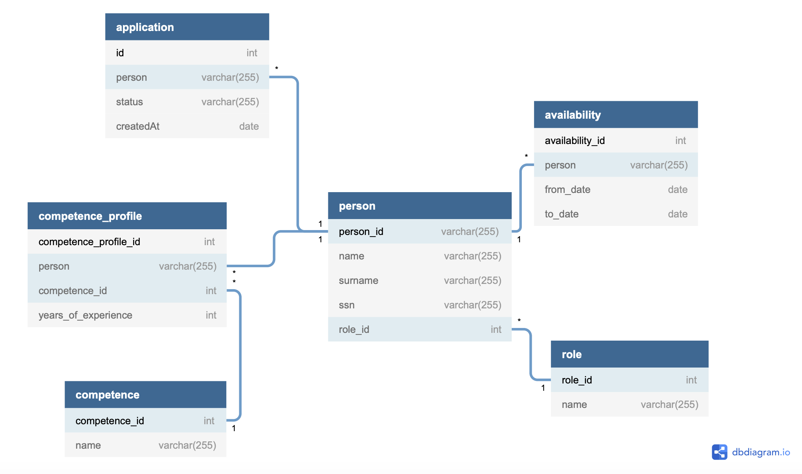

# Firebase Cloud & Heroku PostgresQL Database
The application is hosted on the firebase platform, by Google. Firebase hosts the react application as well as the Rest API for handling all business logic. The database is a SQL database and is hosted on Heroku as Firebase does not support SQL databases.

## Prerequisites
The developer should be experienced with developing firebase applications using Node JS and SQL. 

## Architecture
The rest api is built feature driven with the MVC pattern to better support scaling of the application. 

## Firebase Console
Permission needed to access the console.
https://console.firebase.google.com/project/iv1201-g7/overview

## Dev Environment Setup
The following sections explains how to install firebase tools on your system and how to serve the rest api locally. It is required that npm and node is already installed on the system.

### Installing Firebase CLI
```shell
npm install -g firebase-tools
```

### Login with CLI
You will be promted to login with email and password. Access to project is needed to succeed with this step.
```shell
firebase login
```

### Creating service key
To be able to run the api locally, the developer needs a service key. It can be downloaded at https://console.firebase.google.com/project/iv1201-g7/settings/serviceaccounts/adminsdk. When downloaded, store the file locally on your computer, anywhere. Then, under firebase/functions/configs, create a new file called serviceAccount.js and add following to the file:

```javascript
// firebase/functions/configs/serviceAccount.js
exports.serviceAccount = require("/path/to/iv1201-g7-firebase-adminsdk-d4csr-1a64f29c56.json");
```

### Serving api locally
```shell
firebase serve --only functions
```

## Building & Deploying the app

### Deploying to production
First build the react app with "npm run build" and move the content created in *react_app/build* into *firebase/public*. Then run following command. 
As long as the linter is okay with current build in the functions folder the app will be deployed. 
```shell
# From root folder 
# Delete current build
rm -rf firebase/public/*

# Move react build into firebase public
mv react_app/build/* firebase/public/

# Deploy application
firebase deploy
```

## PostgresQL Database

### Connection
To connect to the database. Use the function *conn* in file *firebase/functions/commmon/db/index.js* as following.

```javascript
// Import database module
const db = require('./relative/path/to/db/index.js');

// Init a connection
const client = db.conn()
```

### Database Schema



## Database migration
To move all data from the old solution to the new database, a migration module was created. A localhost mysql database was used to simulate the old database.  

### Migration Flow 
1. Wiping current postgres database to start from zero.
2. Wiping firebase users.
3. Migrating role table.
4. Migrating competence table.
5. Migrating persons/users if they have valid data in old database.
6. Migrating availability.
7. Migrating competence profiles.
8. Adding data to new table 'application' in order to see the users application status and date for submitting the application.  

### Running the migration
```shell
# From root folder
node firebase/functions/api/common/db/migration/index.js
```


